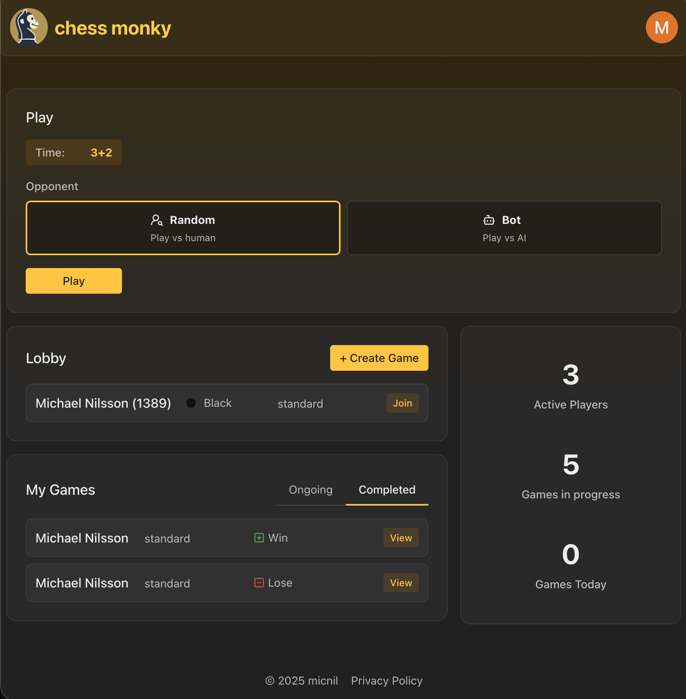
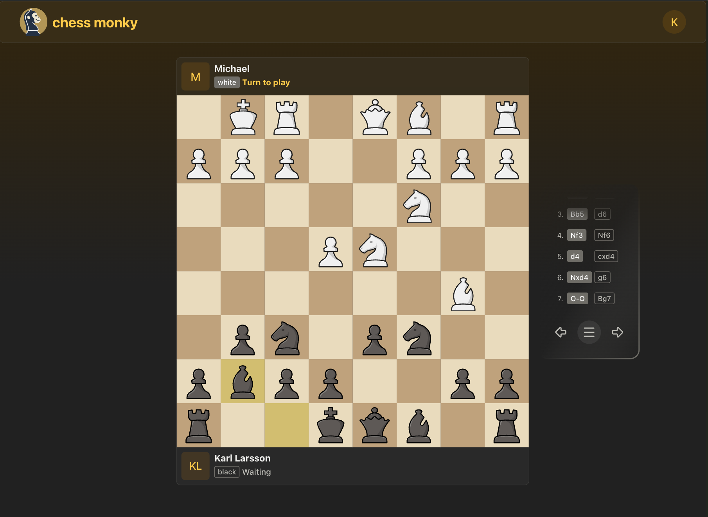

# Michess

A modern chess application built with React, Vite, and TypeScript. Features a interactive chessboard with move validation and game state management.

## Screenshots

<div style="display:flex; flex-wrap: wrap;">
  
  
  
</div>

## Development setup

Install dependencies:

```bash
pnpm install
```

### Frontend

1. Start the development server:

   ```bash
   pnpm nx serve web-chess
   ```

2. Open your browser and navigate to `http://localhost:4200`

### Backend

1. Setup docker

   ```bash
   brew install docker docker-compose colima
   colima start
   ```

2. Setup your `apps/node-chess/.env.local` based on the example file `apps/node-chess/.env.example`.

3. Start databases

   `pnpm start:db`

4. Run migrations

   `pnpm migration:run`

5. Start backend service

   `pnpm start:node`

## Project Structure

This is an Nx monorepo with the following key libraries:

- `core-game` - Chess game logic and move generation
- `react-chessboard` - React chessboard UI components
- `web-chess` - Main Next.js application

## Development

### Running Tests

```bash
# Test all projects
pnpm test:all

# Test specific library
pnpm nx test <library-name>
```

### Building

```bash
# Build the web application
pnpm nx build web-chess
```

### Type Checking

```bash
pnpm run typecheck
```
